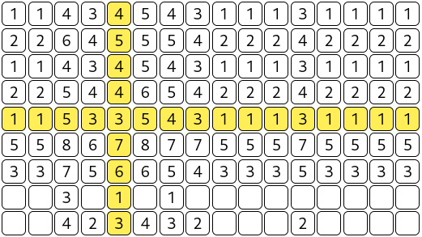

<div align="center">
    <h1>Technical Assessment - Level.Works</h1>

<a href="https://t.me/ExposedCatDev">


</a>
<a href="https://www.reddit.com/user/ExposedCatDev">

</a>



</div>

<div align="center">
    <h2>⭐️ Task</h2>
</div>
<ul>
    Create a grid of 50x50. When you click on a cell, all values in the cells in the same row and column are increased  by 1. If a cell is empty, it will get a value of 1. After each change a cell will briefly turn yellow. If 5 consecutive numbers in the Fibonacci sequence are next to each other, these cells will briefly turn green and will be cleared
</ul>

<div align="center">
    <h2>⚙️ Stack</h2>
</div>
<ul>
    <li>Programming language: JavaScript</li>
    <li>DOM manipulation: Pure web API</li>
    <li>Documentation: JSDoc</li>
    <li>Running tools: Browser</li>
</ul>

<div align="center">
    <h2>🔌 Running</h2>
</div>

<div align="center">
    <h2>via Browser (local)</h2>
</div>

1. Clone this repo:

```bash
git clone https://github.com/ExposedCat/level-works-test-task.git
```

2. Go to the project root:

```bash
cd ./level-works-test-task
```
3. Open `src/index.html` via browser (example: <a href="https://www.mozilla.org/en-US/firefox/new/">Firefox</a>):

```bash
firefox ./src/index.html
```
<div align="center">
    <h2>via Browser (Pages)</h2>
</div>

1. Go to the <a href="TODO: publish">GitHub Page of this repo</a>